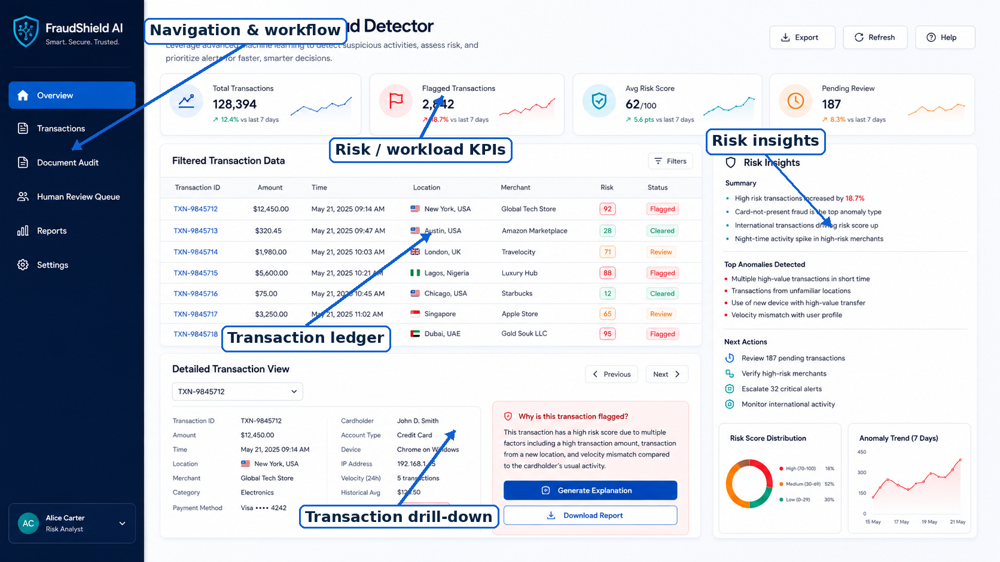
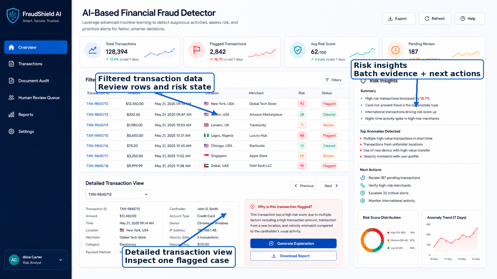
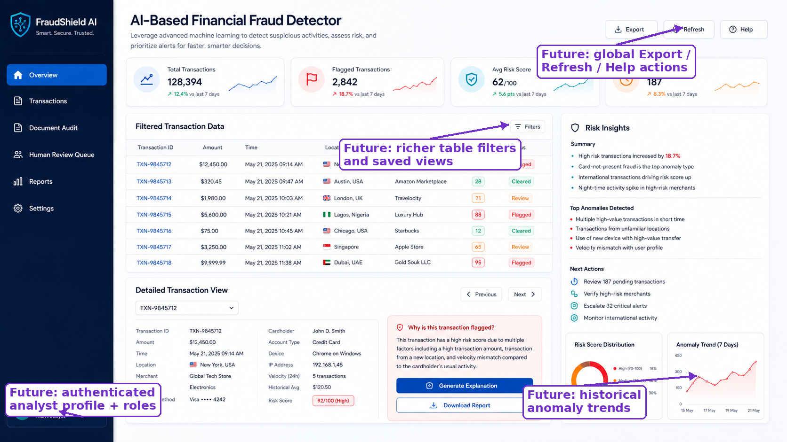

# AI Audit — Fraud Screening & Human Review Platform

A hackathon-to-portfolio project for **fraud-pattern clustering in transactions** with an integrated document-audit path.

The system does **not** claim that an anomaly is fraud. It converts transaction behaviour and document-control findings into explainable evidence, a transparent review-priority score, and a human-review route.

## What the platform does

### Transaction intelligence

Upload a CSV/XLSX ledger and the system:

1. auto-recognizes common column aliases and small spelling mistakes,
2. maps the input into a canonical internal schema,
3. validates the minimum fields required to run the ML pipeline,
4. engineers behavioural features,
5. applies **K-Means behavioural clustering**,
6. applies **Isolation Forest** unusualness screening,
7. runs explicit audit-pattern signals such as duplicate/split payments, bursts and behavioural shifts,
8. combines that evidence into a 0–100 **review-priority score**,
9. routes rows to LOW / MEDIUM / HIGH / CRITICAL review levels,
10. produces a human-review queue and Excel audit report.

### Document audit

Upload a structured invoice/expense document (JSON/CSV; PDF/image demo paths also exist) and the system:

1. extracts a trusted structured representation,
2. applies deterministic audit controls,
3. performs a historical amount check,
4. scans free text for prompt-injection-style content before any LLM explanation,
5. computes the document audit risk score,
6. feeds the result into the **same operational review hierarchy** used by transaction analysis,
7. optionally generates an explanation from already-computed findings,
8. produces a document audit report and unified human-review entry.

### Grounded audit assistant

Phase 7 adds a conversational layer over **already-computed** audit results. It can answer questions such as:

- `Why was TX00428 flagged?`
- `Show anomalies for EMP004`
- `Which department has the highest anomaly rate?`
- `Why did this batch require systemic review?`
- `What signals were skipped because of schema coverage?`
- `How many pending reviews are there?`
- `Explain the current document audit`

The assistant does not rerun K-Means, Isolation Forest, document rules or risk scoring. It retrieves a bounded fact packet from the cached analysis and explains that evidence. If an Anthropic API key is configured, the LLM may improve wording **only after retrieval**; without a key, deterministic grounded answers remain fully functional.

## Phase 7 architecture

```text
                   ┌───────────────────────────────┐
                   │       AI AUDIT PLATFORM       │
                   └───────────────────────────────┘
                              │             │
                  ┌───────────┘             └───────────┐
                  ▼                                     ▼
      Transaction Intelligence                   Document Audit
      CSV / XLSX ledger                          Invoice / evidence
                  │                                     │
      Schema mapping + validation                 Extraction + sanitization
                  │                                     │
      Behavioural features                       Deterministic controls
                  │                                     │
      K-Means + Isolation Forest                 Statistical amount check
      + explicit audit patterns                  + AI-integrity check
                  │                                     │
                  └───────────────┬─────────────────────┘
                                  ▼
                        Shared Review Workflow
                         LOW / MEDIUM / HIGH /
                               CRITICAL
                                  │
                  ┌───────────────┴────────────────┐
                  ▼                                ▼
          Human Review Queue                  Audit Reports
                  │                                │
                  └───────────────┬────────────────┘
                                  ▼
                      Grounded Audit Assistant
                 retrieve computed facts → explain
                 (never recompute or declare fraud)
```

The shared workflow is implemented in `app/audit/review_workflow.py` and is used by both document and transaction paths.

## Human-review routing

| Review priority | Operational decision | Reviewer |
|---|---|---|
| **LOW** | Auto-cleared | Automated screening |
| **MEDIUM** | Manager review | Employee manager for transactions; Accounts Payable / Line Manager for documents |
| **HIGH** | Finance review | Finance Manager / Internal Auditor |
| **CRITICAL** | Critical escalation | Senior Auditor / Fraud Investigation |

The review score is **not a calibrated fraud probability**.

## Transaction input schema

The external spreadsheet can use aliases or minor misspellings. Internally the project always converts data to one canonical schema.

### Minimum requirement — required to run ML

- `transaction_id`
- `date`
- `amount`
- at least one of `employee_id` or `employee_name`

### Recommended context

- `vendor`
- `category`
- `location`
- `department`
- `manager_name`
- `payment_method`

Recommended fields strengthen context-specific detection but are **not mandatory**. If a field is unavailable, only the dependent checks are skipped. For example, a ledger without `vendor` does not run vendor-burst or vendor-frequency logic.

### Schema-recognition demo files

`data/schema_examples/` contains:

- `01_minimum_required_sample.xlsx` — minimum accepted ML schema
- `02_medium_context_typo_sample.xlsx` — richer context with intentional header spelling mistakes

The UI exposes both as downloadable examples.

## Transaction detection model

```text
Transaction ledger
      ↓
Schema recognition + normalization
      ↓
Behavioural feature engineering
      ↓
StandardScaler
      ↓
┌─────────────────┬───────────────────┬─────────────────────┐
│ K-Means         │ Isolation Forest  │ Explicit audit      │
│ peer behaviour  │ global unusualness│ pattern signals     │
└─────────────────┴───────────────────┴─────────────────────┘
      ↓
Explainable evidence combination
      ↓
Review-priority score + reviewer routing
```

Important interpretations:

- **Cluster ID** identifies a behavioural peer group; it is not a fraud/safe label.
- **Cluster distance** measures how atypical a row is relative to its assigned peer group.
- **Isolation score** is unusualness evidence from Isolation Forest.
- **Pattern flags** are explicit audit signals such as duplicate payment, split payment, vendor burst, employee burst, repeated rounded amounts, category/location shifts and amount deviation.
- **Risk score** prioritizes review; it is not the probability that fraud occurred.

## Benchmark integrity

Synthetic benchmark workbooks may contain `synthetic_anomaly` and `anomaly_type`.

Those columns are **evaluation-only**:

- they are excluded from model features,
- predictions are produced first,
- labels are read afterward to calculate precision, recall, F1 and pattern-level detection.

The test suite contains leakage checks to enforce this separation.

## User interface

The Streamlit UI was redesigned in Phase 6 as a unified audit workspace with a dark navigation rail and a wide enterprise-style working area.

Pages:

- **Overview** — current workload, high-level KPIs, transaction risk distribution and latest document status
- **Transaction Analysis** — upload/demo flow, suspicious ledger, review queue, selected-transaction insight panel, schema coverage and ML interpretation
- **Document Audit** — document upload/sample flow, findings, routing and explanation
- **Human Review Queue** — one operational queue combining transaction and document review items
- **Audit Assistant** — conversational retrieval/explanation over cached transaction and document evidence
- **Reports** — downloadable transaction and document audit workbooks

Completed analyses are stored in Streamlit session state. Changing the selected transaction or downloading a report does not rerun the backend ML pipeline. The selected-transaction insight panel uses `st.fragment` so that interaction can rerun only that section.

## Audit reports

### Transaction workbook

The transaction report can contain:

- Executive Summary
- All Transactions
- Anomalies Only
- Human Review Queue
- Cluster Summary
- Evaluation Metrics
- Pattern Evaluation
- Metric Definitions
- Schema Mapping
- Data Coverage

### Document workbook

The document report contains:

- Executive Summary
- Findings
- Human Review Queue
- Extracted Document
- Metric Definitions

## Project structure

```text
ai-audit/
├── app/
│   ├── main.py
│   ├── api/
│   │   └── routes.py
│   ├── ai/
│   │   ├── audit_chat.py
│   │   └── explainer.py
│   ├── audit/
│   │   ├── anomaly.py
│   │   ├── review_workflow.py
│   │   ├── rules.py
│   │   ├── scoring.py
│   │   └── transaction_risk.py
│   ├── extraction/
│   │   ├── document_parser.py
│   │   └── transaction_parser.py
│   └── models/
│       └── schemas.py
├── data/
│   ├── evaluation/
│   ├── sample/
│   └── schema_examples/
├── docs/
│   ├── MODEL_NOTES.md
│   └── PROJECT_HISTORY.md
├── frontend/
│   └── streamlit_app.py
├── scripts/
│   ├── create_evaluation_suite.py
│   └── generate_transactions.py
├── tests/
├── config.py
├── requirements.txt
└── README.md
```

## Setup

PowerShell / Windows:

```powershell
python -m venv .venv
.\.venv\Scripts\Activate.ps1
pip install -r requirements.txt
```

Optional: copy `.env.example` to `.env` and provide an LLM key if you want LLM-generated explanations. The system remains functional without one.

## Run

Terminal 1 — FastAPI backend:

```powershell
uvicorn app.main:app --reload
```

Terminal 2 — Streamlit frontend:

```powershell
streamlit run frontend/streamlit_app.py
```

FastAPI developer docs are available locally at:

```text
http://127.0.0.1:8000/docs
```

## Testing

```powershell
pytest -q
```

Phase 7 checkpoint: **53 tests passing**.

Coverage includes deterministic rules, extraction, anomaly detection, schema mapping, synthetic-label leakage protection, transaction risk routing, the shared document/transaction review workflow, and grounded assistant retrieval/answer invariants.

## Design principles

1. **Anomaly ≠ fraud.** A flag means suspicious behaviour requires attention.
2. **Human-led decisions.** The system prioritizes and explains; a reviewer decides.
3. **LLM downstream only.** The LLM explains precomputed findings and does not determine fraud/risk.
4. **Chat is retrieval-first.** The audit assistant retrieves bounded facts from cached results before producing an answer; unsupported questions are rejected rather than guessed.
5. **Flexible input, fixed internal schema.** External spreadsheets can vary; downstream code receives canonical fields.
6. **Missing context is visible.** Context-dependent signals are skipped rather than fabricated.
7. **Evaluation labels never leak into inference.** Synthetic ground truth is benchmark-only.
8. **Relative models have limits.** Majority-abnormal/systemic ledgers can distort unsupervised notions of normal; policy controls and human review remain necessary.

## Current status

Completed through **Phase 7**:

- Phase 1 — transaction ingestion / validation
- Phase 2A — basic anomaly engine
- Phase 2B — stronger fraud-pattern intelligence and evaluation
- Phase 3 — explainable risk scoring and supervisory routing
- Phase 4 — professional reporting
- Phase 5 — tester UX, schema examples, persistent UI state
- Phase 6 — document-audit integration + unified review queue + platform UI redesign
- Phase 7 — result-grounded audit assistant over cached transaction/document evidence

Next engineering phase: **Phase 8 — destructive testing, scalability and evaluation hardening**, followed by the final submission/documentation freeze in Phase 9.

## Interface Guide

> The annotated screenshots below are visual guides for the Streamlit presentation layer. Values shown in the design reference are illustrative; actual application values come from the uploaded ledger/document and backend analysis.

### Main audit workspace



- **Navigation & workflow** — moves between overview, transaction analysis, document audit, the unified human-review queue and reports.
- **Risk / workload KPIs** — summarizes the current analysis and review workload without treating risk as a fraud probability.
- **Transaction ledger** — presents suspicious transactions and their operational risk/review state.
- **Risk insights** — summarizes batch-level evidence and reviewer-facing context.
- **Transaction drill-down** — lets an analyst inspect one flagged transaction, its triggered signals and technical evidence. Changing the selected transaction uses Streamlit fragment/session-state behavior rather than rerunning the entire ML pipeline.

### Transaction analysis guide



The transaction page is intentionally organized around a reviewer workflow: scan the filtered ledger, understand batch-level risk context, then drill into a single case. Machine-learning evidence supports the decision; it does not independently establish fraud.

### Future interface plan



The highlighted controls in this image are **future-plan UI concepts and are not claimed as implemented functionality**. They include global export/refresh/help actions, richer saved filters, historical anomaly trends, and authenticated analyst profiles/roles.
