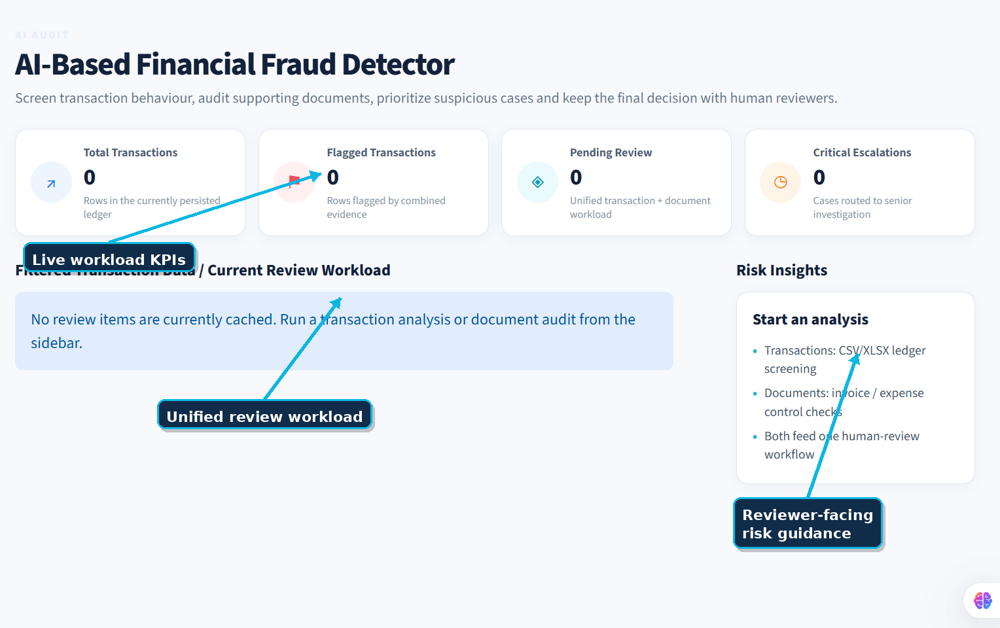
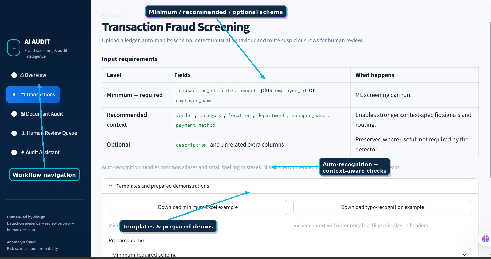
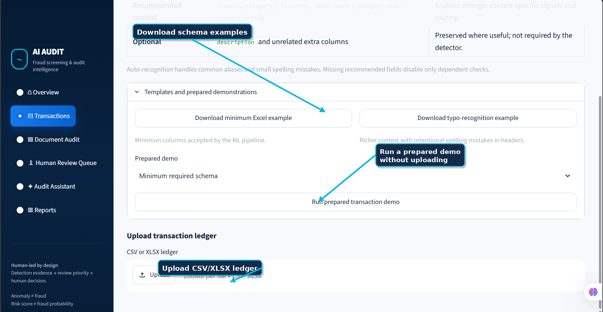
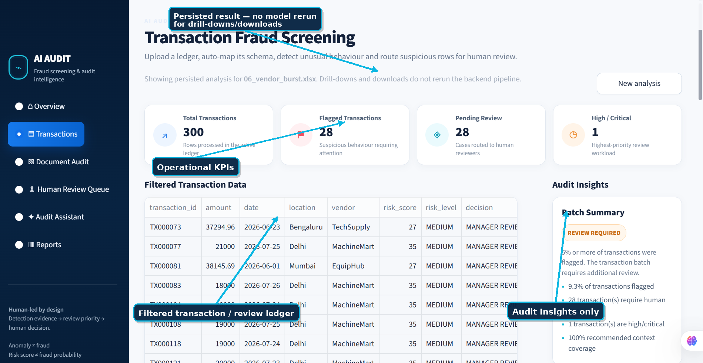
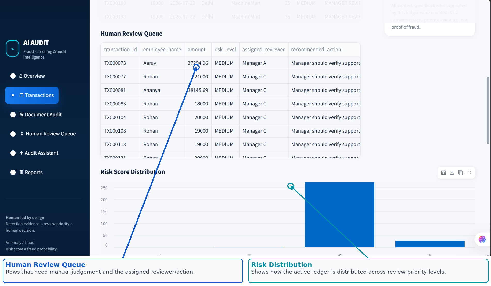
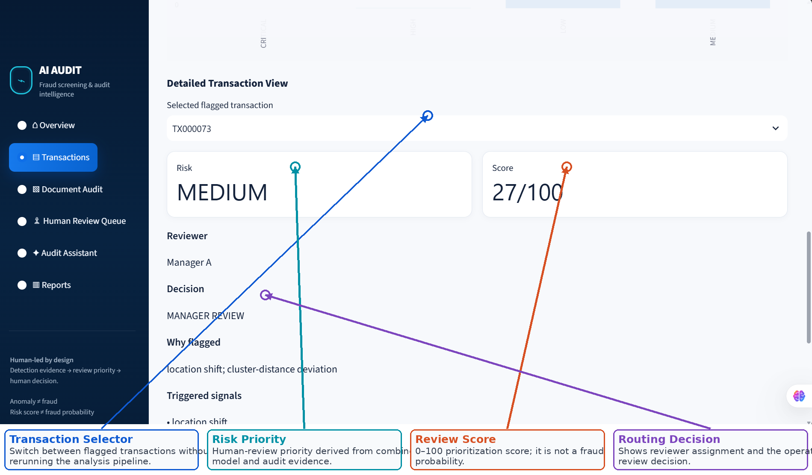
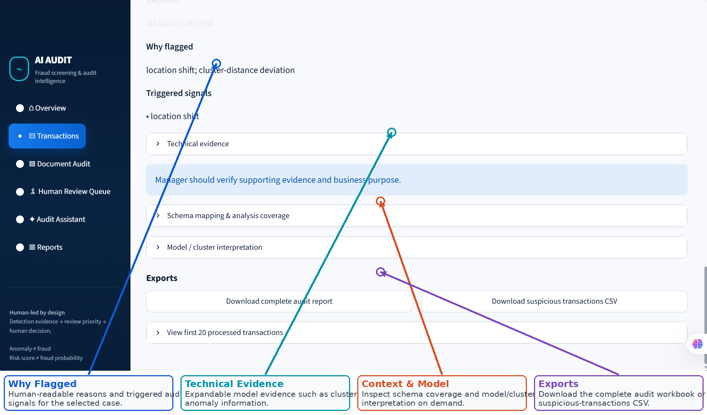
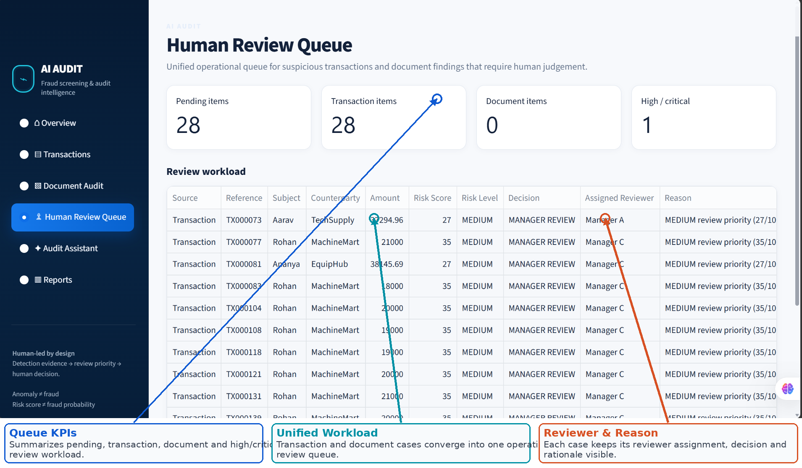
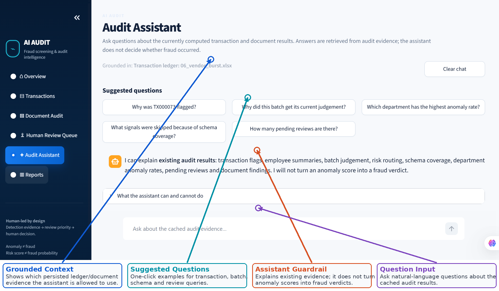
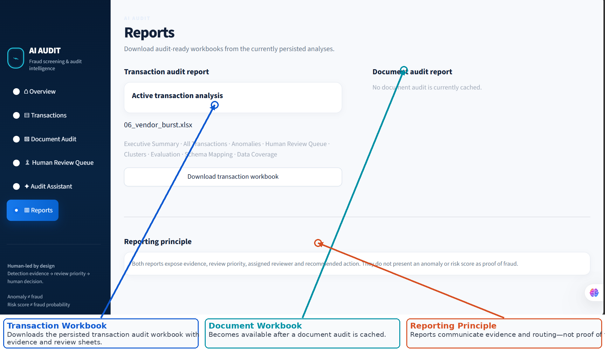

# AI Audit — Financial Fraud Screening & Human Review Platform

AI Audit is a **human-in-the-loop financial audit platform** for screening transaction ledgers and supporting documents, identifying unusual behaviour, prioritizing suspicious cases, and routing evidence to the appropriate reviewer.

> **Anomaly ≠ fraud. Risk score ≠ fraud probability.**  
> AI Audit prioritizes evidence for investigation; the final judgement remains with a human reviewer.

## What the platform does

- Screens **CSV/XLSX transaction ledgers** with flexible, spelling-aware schema recognition.
- Uses **behavioural feature engineering, K-Means, Isolation Forest, and explicit audit-pattern signals**.
- Produces an explainable **0–100 review-priority score** and LOW / MEDIUM / HIGH / CRITICAL routing.
- Skips context-specific checks when optional fields such as vendor, category, or location are unavailable instead of fabricating data.
- Audits **invoices / expense-supporting documents** through a separate deterministic control path.
- Combines transaction and document findings in one **Human Review Queue**.
- Generates audit-ready **Excel reports and CSV exports**.
- Includes a **grounded Audit Assistant** that explains already-computed evidence without independently deciding fraud.
- Persists analysis results so drill-downs, report downloads, and assistant questions do **not** need to rerun the ML pipeline.

---

# Interface walkthrough

The screenshots below are from the working Streamlit application. The arrows describe the purpose of each important interface element. Values shown are from prepared demonstration ledgers and are not claims about real-world fraud performance.

## 1. Operational overview



The Overview page is the starting point for an auditor. It summarizes the persisted transaction/document workload, exposes pending reviews and critical escalations, and provides a direct view of the current reviewer workload.

## 2. Flexible input contract



AI Audit keeps a **fixed canonical schema internally** while allowing more flexible spreadsheets externally.

**Minimum requirement — ML can run:**

- `transaction_id`
- `date`
- `amount`
- at least one of `employee_id` or `employee_name`

**Recommended context — enables stronger signals:**

- `vendor`
- `category`
- `location`
- `department`
- `manager_name`
- `payment_method`

**Optional:** `description` and unrelated extra columns can be preserved where useful.

Common aliases and small spelling mistakes are auto-recognized. For example, a header such as `Merchent` can be mapped to the canonical `vendor` field when the recognition confidence is sufficient.

If recommended context is absent, only the dependent signals are disabled:

```text
vendor missing   → vendor-frequency / vendor-burst dependent checks skipped
location missing → location-shift checks skipped
category missing → category-shift checks skipped
```

The entire analysis is not rejected simply because optional context is unavailable.

## 3. Templates, demonstrations, and upload



The transaction workspace includes:

- a downloadable **minimum-schema Excel example**,
- a **typo-recognition Excel example** with intentionally misspelled headers,
- prepared evaluation/demo ledgers,
- direct CSV/XLSX upload.

The sample workbooks are stored in `data/schema_examples/`.

## 4. Transaction screening result



After analysis, the main workspace shows:

- total transactions,
- flagged transactions,
- pending reviews,
- high/critical workload,
- the filtered transaction/review table,
- a narrow **Audit Insights** panel containing the batch-level interpretation.

Supporting analytics are intentionally placed **below** the operational tables rather than crowding the right-hand insight panel.

## 5. Human-review queue and risk distribution



The transaction-level Human Review Queue shows who needs to inspect each case and the recommended action. The risk-distribution view summarizes how the active ledger is spread across review-priority levels.

A LOW/MEDIUM/HIGH/CRITICAL label is a workflow priority, not a statement that fraud occurred.

## 6. Selected-transaction drill-down



A reviewer can switch between flagged transactions and inspect:

- review priority,
- 0–100 prioritization score,
- assigned reviewer,
- operational decision,
- why the row was flagged,
- triggered audit signals.

The selected-transaction interaction uses persisted Streamlit state so changing the transaction does not require the ledger to be uploaded, validated, feature-engineered, and fitted again.

## 7. Explainability and exports



The review interface separates **human-readable reasons** from expandable technical evidence. Reviewers can inspect model/cluster interpretation and schema coverage only when needed, while the primary workflow remains understandable without ML expertise.

Exports include:

- complete transaction audit workbook,
- suspicious-transactions CSV.

## 8. Unified Human Review Queue



Transaction and document findings converge into one queue. Each item carries its source, reference, subject/counterparty, amount, risk score, risk level, decision, assigned reviewer, and reason.

This turns the project from a row-flagging model into an **operational audit workflow**.

## 9. Grounded Audit Assistant



The assistant answers questions about **persisted audit evidence**, for example:

- `Why was TX00073 flagged?`
- `Why did this batch get its current judgement?`
- `Which department has the highest anomaly rate?`
- `What signals were skipped because of schema coverage?`
- `How many pending reviews are there?`

Its architecture is retrieval-first:

```text
Question
   ↓
Identify requested transaction / employee / department / batch / document
   ↓
Retrieve bounded facts from cached audit results
   ↓
Grounded answer
   ↓ optional
LLM wording improvement
```

The assistant cannot refit K-Means, rerun Isolation Forest, change risk scores or reviewer assignments, or convert anomaly evidence into a fraud verdict.

## 10. Reporting



Reports are generated from the currently persisted analyses. A user does not need to rerun the detector just to download a report.

The reporting principle is the same as the rest of the platform: **expose evidence, review priority, reviewer assignment, and recommended action — not a declaration of fraud.**

---

# System architecture

```text
                     ┌───────────────────────────────┐
                     │       AI AUDIT PLATFORM       │
                     └───────────────────────────────┘
                                │             │
                    ┌───────────┘             └───────────┐
                    ▼                                     ▼
        Transaction Intelligence                   Document Audit
        CSV / XLSX ledger                          Invoice / evidence
                    │                                     │
        Schema mapping + validation                 Extraction + sanitization
                    │                                     │
        Behavioural features                       Deterministic controls
                    │                                     │
        K-Means + Isolation Forest                 Statistical amount check
        + explicit audit patterns                  + AI-integrity check
                    │                                     │
                    └───────────────┬─────────────────────┘
                                    ▼
                          Shared Review Workflow
                       LOW / MEDIUM / HIGH / CRITICAL
                                    │
                    ┌───────────────┴────────────────┐
                    ▼                                ▼
            Human Review Queue                  Audit Reports
                    │                                │
                    └───────────────┬────────────────┘
                                    ▼
                        Grounded Audit Assistant
                   retrieve computed facts → explain
```

The shared routing logic is implemented in `app/audit/review_workflow.py`.

## Review routing

| Review priority | Operational decision | Reviewer |
|---|---|---|
| **LOW** | Auto-cleared | Automated screening |
| **MEDIUM** | Manager review | Employee manager for transactions; Accounts Payable / Line Manager for documents |
| **HIGH** | Finance review | Finance Manager / Internal Auditor |
| **CRITICAL** | Critical escalation | Senior Auditor / Fraud Investigation |

---

# Transaction detection engine

```text
Transaction ledger
      ↓
Schema recognition + normalization
      ↓
Behavioural feature engineering
      ↓
StandardScaler
      ↓
┌──────────────────┬────────────────────┬──────────────────────┐
│ K-Means          │ Isolation Forest   │ Explicit audit       │
│ peer behaviour   │ global unusualness │ pattern signals      │
└──────────────────┴────────────────────┴──────────────────────┘
      ↓
Evidence combination
      ↓
Review-priority score + reviewer routing
```

## Evidence produced by the engine

- **Cluster ID** — behavioural peer-group identifier; not a fraud/safe label.
- **Cluster distance** — how atypical a row is relative to its assigned peer group.
- **Isolation score** — global multidimensional unusualness evidence.
- **Pattern signals** — interpretable audit patterns available from the supplied context.
- **Risk score** — 0–100 review-priority score; **not a calibrated fraud probability**.

## Explicit audit-pattern intelligence

Depending on available fields, the engine can evaluate:

- duplicate payments,
- split payments,
- vendor bursts,
- employee bursts,
- repeated rounded amounts,
- amount deviations,
- category shifts,
- location shifts,
- external approval-threshold signals.

The hybrid design deliberately combines two types of evidence:

```text
Unsupervised ML
→ behaviour that is unusual relative to peers / the dataset

Explicit audit patterns
→ recognizable control or behavioural conditions a reviewer can inspect
```

---

# Benchmark integrity and evaluation

Prepared synthetic workbooks may contain `synthetic_anomaly` and `anomaly_type`, but those columns are **evaluation-only** and are explicitly excluded from inference features.

```text
Build inference features
      ↓
Fit / score the detector
      ↓
Produce predictions
      ↓
Only then compare with benchmark labels
      ↓
TP / FP / FN / TN, precision, recall, F1
```

Tests verify that changing benchmark labels does not change the model feature matrix or predictions. This prevents synthetic ground truth from leaking into the detector.

Evaluation metrics describe performance on the prepared benchmark workbooks; they are not presented as universal real-world fraud-detection accuracy.

---

# Document audit path

The document side is a separate evidence pipeline that converges with transaction screening at the review-workflow layer.

```text
Document / invoice
      ↓
Extraction + normalization
      ↓
Deterministic audit controls
      ↓
Historical amount context / anomaly check
      ↓
Review priority + reviewer routing
      ↓
Human Review Queue + report
      ↓ optional
Grounded explanation
```

The document workflow can produce:

- extracted document evidence,
- deterministic rule findings,
- historical amount context,
- risk/review priority,
- assigned reviewer,
- recommended action,
- optional downstream explanation,
- downloadable audit workbook.

---

# Reporting outputs

## Transaction workbook

The generated workbook can contain:

- Executive Summary
- All Transactions
- Anomalies Only
- Human Review Queue
- Cluster Summary
- Evaluation Metrics
- Pattern Evaluation
- Metric Definitions
- Schema Mapping
- Data Coverage

## Document workbook

The document report can contain:

- Executive Summary
- Findings
- Human Review Queue
- Extracted Document
- Metric Definitions

---

# Project structure

```text
ai-audit/
├── app/
│   ├── main.py
│   ├── api/
│   │   └── routes.py
│   ├── ai/
│   │   ├── audit_chat.py
│   │   └── explainer.py
│   ├── audit/
│   │   ├── anomaly.py
│   │   ├── review_workflow.py
│   │   ├── rules.py
│   │   ├── scoring.py
│   │   └── transaction_risk.py
│   ├── extraction/
│   │   ├── document_parser.py
│   │   └── transaction_parser.py
│   └── models/
│       └── schemas.py
├── data/
│   ├── evaluation/
│   ├── sample/
│   └── schema_examples/
├── docs/
│   ├── images/
│   │   └── actual_ui/
│   ├── MODEL_NOTES.md
│   └── PROJECT_HISTORY.md
├── frontend/
│   └── streamlit_app.py
├── scripts/
│   ├── create_evaluation_suite.py
│   └── generate_transactions.py
├── tests/
├── config.py
├── requirements.txt
└── README.md
```

---

# Setup

## Windows / PowerShell

```powershell
python -m venv .venv
.\.venv\Scripts\Activate.ps1
pip install -r requirements.txt
```

Optional: copy `.env.example` to `.env` and configure an LLM key if LLM-assisted wording is desired. Core transaction screening, document controls, risk routing, reporting, and deterministic grounded assistant behaviour do not require an LLM key.

## Start FastAPI

```powershell
uvicorn app.main:app --reload
```

Developer API documentation is available at:

```text
http://127.0.0.1:8000/docs
```

## Start Streamlit

In a second terminal:

```powershell
streamlit run frontend/streamlit_app.py
```

---

# Testing

```powershell
pytest -q
```

Current checkpoint: **53 automated tests passing**.

The suite covers:

- deterministic document-audit rules,
- extraction and validation,
- transaction anomaly detection,
- spelling-aware schema mapping,
- optional-context behaviour,
- synthetic-label leakage protection,
- transaction risk routing,
- shared document/transaction review workflow,
- grounded assistant retrieval and guardrails.

---

# Design principles

1. **Anomaly ≠ fraud.** Suspicious behaviour is evidence for investigation, not a verdict.
2. **Human-led decisions.** The system prioritizes, routes, and explains; reviewers decide.
3. **LLM downstream only.** LLM output cannot determine fraud or risk.
4. **Retrieval-first assistant.** Answers are grounded in bounded cached evidence.
5. **Flexible external input, fixed internal schema.** User spreadsheets are normalized before downstream analysis.
6. **Missing context is explicit.** Dependent checks are skipped rather than supplied with fabricated placeholders.
7. **Evaluation labels never leak into inference.** Synthetic ground truth is benchmark-only.
8. **Persist expensive analysis.** UI interaction and report downloads should not unnecessarily refit the models.
9. **Relative anomaly methods have limits.** Systemic/majority-abnormal data can distort the notion of normal, so policy controls and human review remain necessary.

---

# Limitations

AI Audit is a **screening and review-prioritization system**. Fraud requires contextual investigation and cannot be established solely from clustering, anomaly scores, deterministic rules, or an LLM-generated explanation.

Important practical limitations include:

- unsupervised models are sensitive to the behaviour represented in the uploaded ledger,
- majority-abnormal datasets can make relative anomaly detection harder,
- missing recommended context reduces the number of available signals,
- synthetic benchmark performance should not be treated as production fraud accuracy,
- production deployment would require stronger identity/access controls, audit logging, persistent databases, model/version governance, monitoring, and data-protection controls.

---

# Development status

The current implementation includes:

- transaction ingestion and schema validation,
- baseline and behavioural anomaly detection,
- explicit fraud-pattern intelligence,
- risk scoring and reviewer routing,
- professional Excel reporting,
- flexible schema recognition and persistent frontend state,
- unified transaction/document workflow,
- grounded audit assistant,
- prepared evaluation datasets and automated regression tests.

The next engineering work is **hardening rather than feature expansion**: larger-ledger scalability tests, broader destructive edge cases, deployment controls, persistent storage, authentication/authorization, and production monitoring.
